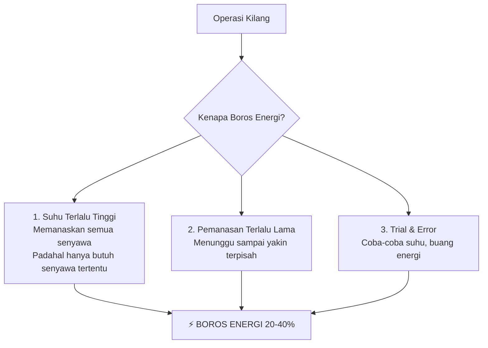

**Oke, mari saya jelaskan dengan analogi yang lebih konkret!**

---

## **ANALOGI: MEMASAK AIR UNTUK MIE INSTAN**

### **Skenario 1: TANPA PREDIKSI TITIK DIDIH**
```
Anda mau masak mie:
- Panci kosong → Anda pasang kompor
- Tunggu air mendidih (100°C) → Butuh 10 menit
- Masukkan mie → Masak 3 menit
- Total: 13 menit, gas terpakai 13 menit

PROBLEM: Anda TIDAK TAHU kapan air akan mendidih!
Jadi kompor terus menyala sampai 100°C.
```

### **Skenario 2: DENGAN PREDIKSI TITIK DIDIH**
```
Anda punya "prediktor ajaib" yang bisa bilang:
"Airmu akan mendidih dalam 8 menit!"

LANGKAH CERDAS:
- Kompor menyala 8 menit → tepat di 100°C
- Masak mie 3 menit
- Total: 11 menit, gas terpakai 11 menit

HEMAT: 2 menit gas! (15% lebih hemat)
```

**Sekarang skala ini kita perbesar 1 JUTA KALI...**

---

## **APLIKASI DI KILANG MINYAK**

### **Distilasi = Memasak Raksasa**
```
KILANG MINYAK:
- "Panci" raksasa (kolom distilasi) setinggi 10 lantai
- Isinya: Minyak mentah (500+ jenis senyawa)
- Tujuan: Pisahkan jadi bensin, solar, dll

MASALAH NYATA:
Tidak ada yang tahu PERSIS berapa suhu optimal 
untuk setiap "lantai" di kolom distilasi!
```

### **Akibatnya...**


---

## **CONTOH KONKRET DI KILANG**

### **Zona Bensin di Kolom Distilasi:**

#### **TANPA PREDIKSI:**
```
Operator kilang berpikir:
"Bensin butuh suhu 70-200°C...
Biar aman, saya set suhu 220°C!"

AKIBAT:
- Bensin dapat: ✓
- TAPI... solar & kerosin ikut naik ke zona bensin: ✗
- Harus didinginkan ulang: ⚡ BOROS ENERGI!
- Hasil: Bensin tercampur solar → kualitas turun
```

#### **DENGAN PREDIKSI:**
```
Model kita bisa kasih tahu:
"Untuk komponen C5-C12 (bensin):
- C5 (pentana): 36°C sudah menguap
- C8 (oktana): 126°C baru menguap
- C12 (dodekana): 216°C

SUHU OPTIMAL ZONA BENSIN: 35-215°C

Rekomendasi:
- Atur suhu bawah: 35°C
- Atur suhu atas: 215°C
- Tidak perlu 220°C!"
```

**HASIL:**
- Bensin murni, tidak tercampur solar
- **Hemat energi pemanasan 5°C** (dari 220°C jadi 215°C)
- 5°C × kolom raksasa = **penghematan besar!**

---

## **PERHITUNGAN PENGHEMATAN NYATA**

### **Kilang Kapasitas Sedang:**
```
DATA:
- Tinggi kolom distilasi: 50 meter
- Diameter: 8 meter
- Volume minyak: 2,500 m³
- Kapasitas: 100,000 barel/hari

KONSUMSI ENERGI:
- Pemanasan awal: 4,000 MWh/hari
- Biaya listrik: Rp 1,000,000 per MWh
- Total biaya: Rp 4 miliar/hari

DENGAN MODEL PREDIKSI:
- Optimasi suhu: Hemat 5% energi
- 5% × 4,000 MWh = 200 MWh/hari
- Hemat: 200 × Rp 1 juta = Rp 200 juta/hari
- Per tahun: Rp 200 juta × 365 = Rp 73 miliar!

HANYA DENGAN "MENGETAHUI TITIK DIDIH LEBIH AKURAT"!
```

---

## **KENAPA PREDIKSI SULIT?**
**Karena minyak mentah itu...**
```
BUKAN 1 jenis senyawa, tapi:
→ 500+ jenis hidrokarbon berbeda
→ Setiap jenis punya titik didih berbeda
→ Bercampur jadi satu

CONTOH:
1 barel minyak mentah mengandung:
- 100 jenis alkana berbeda
- 50 jenis aromatik berbeda
- Plus belerang, nitrogen, dll

TRADISIONAL: 
Analisis di lab → 4-8 jam → SUDAH TERLAMBAT!
Kilang harus operasi REAL-TIME.

SOLUSI KITA:
Model prediksi → tahu dalam 1 detik!
```

---

## **CARA MENJELASKAN DI MAKALAH:**

### **Versi Singkat (1 paragraf):**
"Proses distilasi minyak bumi mengonsumsi 40% total energi kilang karena beroperasi pada suhu tinggi untuk memastikan semua komponen terpisah. Namun, tanpa prediksi titik didih yang akurat, operator cenderung mengatur suhu lebih tinggi dari kebutuhan sebenarnya sebagai 'margin keamanan', menyebabkan pemborosan energi. Model prediksi titik didih yang akurat memungkinkan penentuan suhu operasi optimal, mengurangi konsumsi energi hingga 5% sekaligus meningkatkan kualitas produk."

### **Versi Analogi (untuk presentasi):**
**"Bayangkan Anda menyetrika 10 baju dengan setrika analog..."**
- Tanpa indikator suhu: Setel ke panas maksimal untuk semua baju → beberapa baju gosong, boros listrik
- Dengan thermometer: Tahu baju katun butuh 150°C, sutra 110°C → atur suhu tepat → baju aman, hemat listrik

**Kolom distilasi = "Setrika raksasa" untuk minyak mentah!**

### **Versi Visual:**
```
BEFORE (Tanpa Prediksi):
SUHU KOLOM: [========== 250°C ==========]
            ↑ terlalu panas
            ↓ boros energi 20%

AFTER (Dengan Prediksi):
SUHU KOLOM: [== 215°C ==][== 300°C ==][== 350°C ==]
            ↑ bensin    ↑ solar     ↑ residu
            ↓ tepat!    ↓ tepat!    ↓ tepat!
            ↓ hemat energi 5%
```

---

## **POIN-POIN KUNCI UNTUK LATAR BELAKANG:**

1. **FAKTA:** Distilasi = proses paling boros energi di kilang (40%)
2. **MASALAH:** Operasi berdasarkan estimasi kasar, bukan data akurat
3. **AKIBAT:** Suhu terlalu tinggi → boros energi + kualitas turun
4. **SOLUSI LAMA:** Trial-error, buang waktu dan energi
5. **SOLUSI BARU:** Model prediksi titik didih → tahu suhu optimal
6. **MANFAAT:** Hemat energi + produk lebih baik

**Intinya:**  
**"Mengetahui titik didih dengan akurat = Mengetahui suhu operasi optimal = Tidak memanaskan berlebihan = Hemat energi besar-besaran"**

Sama seperti Anda tidak akan memanaskan oven ke 300°C hanya untuk menghangatkan roti 5 menit. Anda akan atur ke 180°C tepat. Itulah yang model prediksi kita lakukan untuk kilang minyak!
